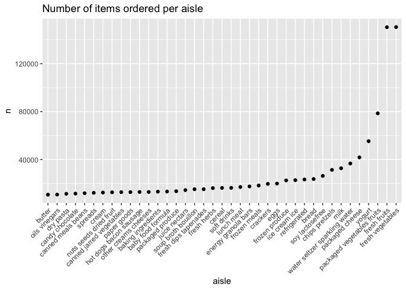
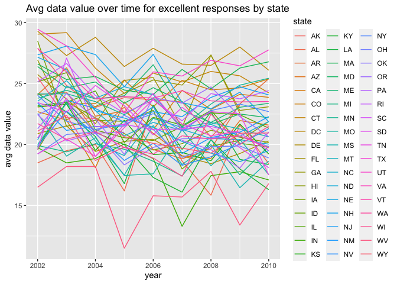
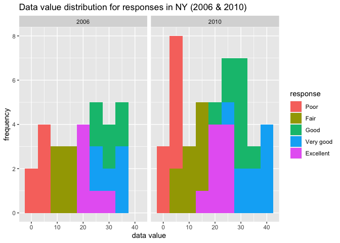
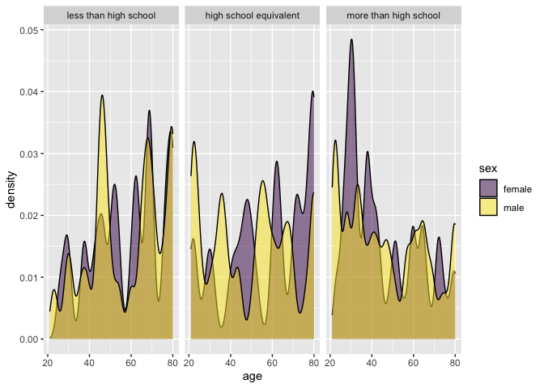
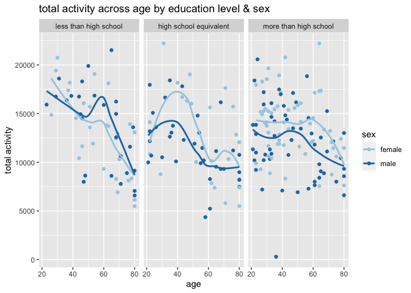
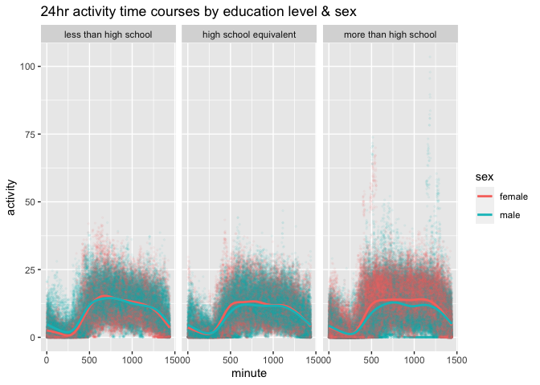

p8105\_hw3\_ga2612
================
Lupe Antonio
10/26/2023

# Problem 1

``` r
#loading dataset
data("instacart")

instacart <- instacart %>% as_tibble()
```

The instacart dataset has 1384617 observations and 15 variables/columns.
Each row in this dataset represents a single product ordered through
instacart. Variables of this dataset include order, product, and user
IDs. Additionally, there are variables corresponding to the order in
which product was added to cart, the time of order, days since prior
order. There are also variables that describe the product, including
product name (i.e. Yogurt, Milk, Water), the aisle (i.e. yogurt, fresh
vegetables) and department (i.e. dairy eggs, produce) where it is
located and the corresponding aisle and department IDs.

``` r
instacart %>%
  count(aisle) %>%
  arrange(desc(n))
```

    ## # A tibble: 134 × 2
    ##    aisle                              n
    ##    <chr>                          <int>
    ##  1 fresh vegetables              150609
    ##  2 fresh fruits                  150473
    ##  3 packaged vegetables fruits     78493
    ##  4 yogurt                         55240
    ##  5 packaged cheese                41699
    ##  6 water seltzer sparkling water  36617
    ##  7 milk                           32644
    ##  8 chips pretzels                 31269
    ##  9 soy lactosefree                26240
    ## 10 bread                          23635
    ## # ℹ 124 more rows

There are a total of 134 aisles with fresh vegetables and fresh fruits
being the ones ordered most from. Above is a chart summarizing all
aisles with the number of products ordered per aisle.

Below is a plot that shows the number of items ordered per aisle, for
aisles with more than 10000 items ordered. The aisles are displayed in
an ascending order, by number of items ordered per aisle.

``` r
instacart %>%
  count(aisle) %>%
  filter(n > 10000) %>%
  mutate(aisle = fct_reorder(aisle, n)) %>%
  ggplot(aes(x = aisle, y = n)) +
  geom_point() +
  ggtitle('Number of items ordered per aisle') +
  theme(axis.text.x = element_text(angle = 45, hjust = 1))
```

<!-- -->

The table below shows the three most popular items in aisles “baking
ingredients”, “dog food care”, and “packaged vegetables fruits”. We can
also see the number of times each product was ordered.

``` r
instacart %>%  
  filter(aisle == "baking ingredients" | aisle == "dog food care" | aisle == "packaged vegetables fruits") %>%
  group_by(aisle) %>%
  count(product_name) %>%
  #min_rank gives rank to each tie (btwn each filtering condition)
  #& we're going based on the highest n in each
  mutate(rank = min_rank(desc(n))) %>%
  filter(rank < 4) %>%
  arrange(desc(n)) %>%
  knitr::kable()
```

| aisle                      | product\_name                                 |    n | rank |
| :------------------------- | :-------------------------------------------- | ---: | ---: |
| packaged vegetables fruits | Organic Baby Spinach                          | 9784 |    1 |
| packaged vegetables fruits | Organic Raspberries                           | 5546 |    2 |
| packaged vegetables fruits | Organic Blueberries                           | 4966 |    3 |
| baking ingredients         | Light Brown Sugar                             |  499 |    1 |
| baking ingredients         | Pure Baking Soda                              |  387 |    2 |
| baking ingredients         | Cane Sugar                                    |  336 |    3 |
| dog food care              | Snack Sticks Chicken & Rice Recipe Dog Treats |   30 |    1 |
| dog food care              | Organix Chicken & Brown Rice Recipe           |   28 |    2 |
| dog food care              | Small Dog Biscuits                            |   26 |    3 |

Below is a table that displays the average hour of the day at which Pink
Lady Apples and Coffee Ice Cream are ordered on each day of the week.
Based on the table, we can see that Pink Lady Apples tend to be ordered
earlier in the day compared to Coffee Ice Cream. Day 5 is the exception,
where they were on average ordered in the same hour of that day.

``` r
instacart %>%
  filter(product_name == "Pink Lady Apples" | product_name == "Coffee Ice Cream") %>%
  group_by(product_name, order_dow) %>%
  summarize(avg_hour_of_day = mean(order_hour_of_day)) %>%
  pivot_wider(names_from = order_dow,
              values_from = avg_hour_of_day) %>%
  knitr::kable(digits = 2)
```

| product\_name    |     0 |     1 |     2 |     3 |     4 |     5 |     6 |
| :--------------- | ----: | ----: | ----: | ----: | ----: | ----: | ----: |
| Coffee Ice Cream | 13.77 | 14.32 | 15.38 | 15.32 | 15.22 | 12.26 | 13.83 |
| Pink Lady Apples | 13.44 | 11.36 | 11.70 | 14.25 | 11.55 | 12.78 | 11.94 |

# Problem 2

``` r
#loading dataset
data("brfss_smart2010")

brfss_smart2010 <- brfss_smart2010 %>% as_tibble()
```

``` r
#data cleaning
brfss_smart2010 <- janitor::clean_names(brfss_smart2010) %>%
  rename(state = locationabbr,
         county = locationdesc) %>%
  filter(topic == "Overall Health" &
         (response %in% c('Excellent', 'Very good', 'Good', 'Fair', 'Poor'))) %>%
  mutate(response = factor(response, levels = c('Poor', 'Fair', 'Good', 'Very good', 'Excellent')))
```

The table below shows the different states that were observed at 7 or
more locations in 2002. We can see that Connecticut, Florida,
Massachusetts, North Carolina, New Jersey, and Pennsylvania; a total of
6 states were observed at 7 or more locations in 2002.

``` r
#table for states in 2002
brfss_smart2010 %>%
  filter(year == '2002') %>%
  group_by(state) %>%
  summarize(n = n()) %>%
  filter(n >= 35) %>%
  knitr::kable()
```

| state |  n |
| :---- | -: |
| CT    | 35 |
| FL    | 35 |
| MA    | 40 |
| NC    | 35 |
| NJ    | 40 |
| PA    | 50 |

The table below shoes the different states that were observed at 7 or
more location in 2010. We can see that 10 states were observed at 7 or
more locations in 2010; including California, Colorado, Florida,
Massachusetts, Maryland, North Carolina, Nebraska, New Jersey, New York,
Ohio. Overtime, more states were observed at more locations.

``` r
#table for states in 2010
brfss_smart2010 %>%
  filter(year == '2010') %>%
  group_by(state) %>%
  summarize(n = n()) %>%
  filter(n >= 35) %>%
  knitr::kable()
```

| state |   n |
| :---- | --: |
| CA    |  60 |
| CO    |  35 |
| FL    | 205 |
| MA    |  45 |
| MD    |  60 |
| NC    |  60 |
| NE    |  50 |
| NJ    |  95 |
| NY    |  45 |
| OH    |  40 |
| PA    |  35 |
| SC    |  35 |
| TX    |  80 |
| WA    |  50 |

``` r
#excellent data
excellent_data <- brfss_smart2010 %>%
  filter(response == 'Excellent') %>%
  select(year, state, data_value) %>%
  group_by(year, state) %>%
  mutate(avg_data_value = mean(data_value)) %>%
  select(-data_value)
```

``` r
#excellent plot
ggplot(data = excellent_data, aes(x = year, y = avg_data_value, color = state)) +
  geom_line() +
  ylab('avg data value') +
  ggtitle('Avg data value over time for excellent responses by state')
```

    ## Warning: Removed 65 rows containing missing values (`geom_line()`).

<!-- -->

Below are plots for distributions of data value for responses among
location in NY in 2006 and 2010. Based on the plots, we can see that
there were more lower data values for ‘poor’ responses in 2010 than
2006.

``` r
brfss_smart2010 %>%
  filter(state == 'NY',
         year %in% c('2006', '2010')) %>%
  ggplot(aes(x = data_value, fill = response)) +
  geom_histogram(binwidth = 5) +
  facet_grid(~year) +
  xlab('data value') +
  ylab('frequency') +
  ggtitle('Data value distribution for responses in NY (2006 & 2010)')
```

<!-- -->

# Problem 3

``` r
#importing data
nhanes_demo <- read_csv('data_hw3/nhanes_covar.csv')

nhanes_accel <- read_csv('data_hw3/nhanes_accel.csv')
```

``` r
#cleaning data
#note: sex (1 = male, 2 = female), edu (1 = less than high school, 2 = high school equiv, 3 = more than high)
nhanes_demo <- nhanes_demo[-c(1, 2, 3, 4),] %>%
  rename(seqn = '...1',
         sex = '1 = male',
         age = '...3',
         bmi = '...4',
         education = '1 = Less than high school') %>%
  mutate(seqn = as.double(seqn),
         education = case_when(
           education == '1' ~ 'less than high school',
           education == '2' ~ 'high school equivalent',
           education == '3' ~ 'more than high school'),
         sex = case_when(
           sex == '1' ~ 'male',
           sex == '2' ~ 'female')) %>%
  filter(!(is.na(sex)),
         !(is.na(age)),
         !(is.na(bmi)),
         !(is.na(education)))

nhanes_accel <- janitor::clean_names(nhanes_accel) %>%
  pivot_longer(min1:min1440,
               names_to = 'minute',
               values_to = 'mims') %>%
  mutate(minute = as.numeric(str_sub(minute, 4, -1)))
```

``` r
#merging datasets
nhanes_tidy <- left_join(nhanes_demo, nhanes_accel,
                         by = 'seqn')

#cleaning merged data
nhanes_tidy <- nhanes_tidy %>%
  filter(!(age < 21),
         !(is.na(sex)),
         !(is.na(age)),
         !(is.na(bmi)),
         !(is.na(education))) %>%
  mutate(
    sex = as.factor(sex),
    age = as.double(age),
    bmi = as.double(bmi),
    education = as.factor(education)) %>%
  mutate(education = factor(education, levels = c('less than high school',
                                                  'high school equivalent',
                                                  'more than high school')))
```

Below is a table for the number of men and women in each education
category. We can see that when participants had less than high school
and more than high school education, there were more females than males
in both types of education.

``` r
#table for sex & education count
nhanes_demo %>%
  group_by(education, sex) %>%
  count(sex) %>%
  pivot_wider(names_from = education,
              values_from = n) %>%
  knitr::kable()
```

| sex    | high school equivalent | less than high school | more than high school |
| :----- | ---------------------: | --------------------: | --------------------: |
| female |                     23 |                    28 |                    59 |
| male   |                     36 |                    27 |                    56 |

Below is a visualization of the age distributions for men and women in
each education category. We can see that when participants had more than
high school education, they tend to be younger than the participants
with less than or a high school equivalent education.

``` r
nhanes_tidy %>%
  ggplot(aes(x = age, fill = sex)) +
  geom_density(alpha = 0.5) +
  facet_grid(~education) +
  viridis::scale_fill_viridis(discrete = TRUE)
```

<!-- -->

``` r
#another option for color
# scale_fill_brewer(palette = 'PuRd') 
```

Below are plots for total activities across age for men and women in
different education levels. From the plots we can see that for those
with high school equivalent education total activity tended to decline
for both male and females as age increased. For those with more than
high school education, total activity tended to be higher for younger
males than older males; for females there was higher total activity for
middle-aged women.

``` r
#finally? might work, but feeling iffy on total activity observations. 
nhanes_tidy %>%
  group_by(seqn, sex, age, bmi, education) %>%
  summarize(total_activity = sum(mims)) %>%
  ggplot(aes(x = age, y = total_activity, color = sex)) +
  geom_point(alpha = 1) +
  facet_grid(~education) +
  geom_smooth(se = FALSE) +
  scale_color_brewer(palette = 'Paired') +
  ylab('total activity') +
  ggtitle('total activity across age by education level & sex')
```

<!-- -->

``` r
nhanes_tidy %>%
  ggplot(aes(x = minute, y = mims, color = sex)) + 
  geom_point(alpha = .05, size = 0.5) +
  facet_grid(~education) +
  geom_smooth(se = FALSE) +
  ylab('activity') +
  ggtitle('24hr activity time courses by education level & sex')
```

    ## `geom_smooth()` using method = 'gam' and formula = 'y ~ s(x, bs = "cs")'

<!-- -->

The plot above shows the 24-hour activity time courses for each
education level and sex. If we consider minute 0 to be 12am, for all
education levels there is a dip in activity after minute 0 and sometime
after minute 250 - we can attribute it to sleep. For those with more
than high school education, there appears to be higher levels of
activity for females than males; activity levels tend to be evenly
distributed through the day and dip around minute 1250.
